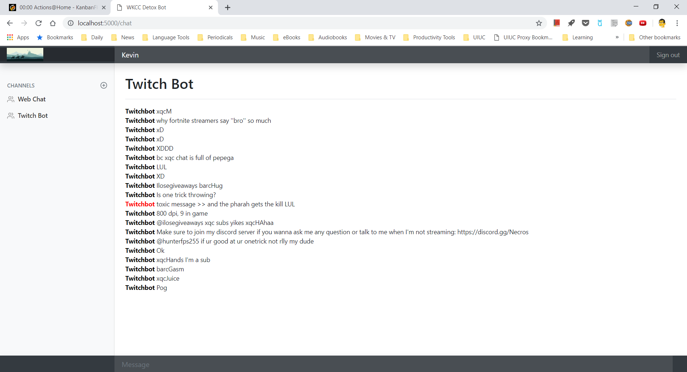

Introduction
============

\IEEEPARstart{O}{nline} <!-- TODO: Automate IEEEPARstart -->
platforms allow people to express their opinions freely, and stimulate collaboration across the globe. Unfortunately, online interaction may often come with loosened inhibitions in making profane, bigoted, or offensive remarks. We refer to such unwelcome remarks as "toxic chat". Online systems may or may not have their own embedded profanity filtering, and those that do typically use pre-registered terms and simple pattern matching. This approach lacks the deeper contextual understanding needed to identify sentences that are toxic but that may not contain banned terms. Thus we propose a new toxic chat filtering system that differentiates itself in that a) its filtering is based on machine learning and deeper contextual analysis, and b) it is deployed as a scalable and easily integrated web framework that can be adapted to any source of text for online interaction of any size. The platform is based on Docker and Kubernetes for easy deployment and dependency management and to allow for fast scale-out to large systems. It uses state-of-the-art distributed systems technology for processing and storage, to allow for rapid scaling to any size while maintaining a shared file space (HDFS) between each Kubernetes Zone. This paper presents the architecture, development, and use of this system in the context of a web chat application and Twitch chatBot as motivating examples.

## What we are going to make 

We will create a prototype of PaaS/SaaS service that provides the following specific capabilities:

* machine-learning-based toxic chat identification and filtering engine
* integerated web chat application or chatbot that uses the engine to analyze a real-time stream of text

Datasets
========

There is a dearth of labelled datasets for training classifiers to detect toxic comments. An online search and literature review were conducted on IEEE Xplore, Scopus, and Science Direct. We concluded that the best dataset available is Toxic Comment Classification Challenge dataset released by Jigsaw and Google on Kaggle in 2018, see [@jigsaw2018]. Note that three additional datasets were identified - from Reddit [@eloi2018;@chandra2018], Wikipedia [@eloi2018], and Twitter [@vanaken2018;@chandra2018]. However, the datasets were not appropriate for use with our classifier. 

Technologies and Tools
=======================

The following technologies and solutions were integrated to provide a general framework that can scale to high volume/traffic in the future.

* Flask, websockets, javascript, bootstrap - web application framework and client-server sockets 
* Docker, Kubernetes - easy deploy and scale out
* CI/CD pipeline - to automate the build, integration, and deployment
* AWS, GCP, Heroku, etc - to deploy the solution into a mainstream PaaS infrastructure 
* HDFS or similar - to store big data and share it between systems
* Scikit-learn or Apache Spark + MLlib - machine learing for the detox engine
* RESTful APIs - to help other applications integrate detox engine in the system

## Web application

The user interface is implemented as a web application reachable via public URL. Python flask was chosen for the web application development framework, due to its simplicity, modularity, and compatibility with deployment to Google Cloud Platform. Client-side programming is done in Javascript with Bootstrap for the GUI framework and websockets for client-server socket connectivity for real-time chat.

In the initial prototype, the web application connects the user to both a webchat and to the "Twitch Bot" that monitors a specific Twitch TV chat channel. Text typed into the web chat or received from Twitch is passed to the classifier. Toxic messages are marked in red with a prefix indicating that the message is toxic. 

In future versions of the application a load balancer can be used to distribute traffic among several instances. Also, a complete application will allow plugs ins for different chat sources (Twitter, web forums, Reddit, Wikipedia), with the user able to specify the chat source and channel (currently this is hard-coded).

## Deployment and scaling
* Docker, Kubernetes - easy deploy and scale out

## Automated build, integration, deployment
* CI/CD pipeline - to automate the build, integration, and deployment

## IaaS/PaaS infrastructure
* AWS, GCP, Heroku, etc - to deploy the solution into a mainstream PaaS infrastructure 

## Shared storage
* HDFS or similar - to store big data and share it between systems

## Machine Learning Framework
* Scikit-learn or Apache Spark + MLlib - machine learing for the detox engine

## Application Programming Interfaces
* RESTful APIs - to help other applications integrate detox engine in the system

Method/Design
=============

## Sub-section

Preliminary Evaluation/Results
===============================

## Toxic chat classification accuracy

We used TF-IDF + Multinomial Naive Bayes for toxic chat classification. For the Machine Learning library and NLP, we used scikit-learn up until now because the library was easy to use and also because we were able to find many examples online. However, we've realized that scikit-learn uses too much memory space when training data gets bigger. That's why we are considering Apache Spark's MLlib as an alternative to scikit-learn in order to run it in cloud service for better scalability and high volume capacity. 

With pyspark's dataframe based ml library the performance metrics are: 
accuracy: 0.871943231441048
precision: 0.4434561626429479
recall: 0.7015075376884422
F1: 0.5434021019852082

Work is still in progress to improve the scores so the F1 score is on-par, if not better, than the F1 score for scikit-learn implementation (It was 0.64)

Precision/Recall/F1-Score : With scikit-learn, we've shuffled the training set and took 20% as the test set for evaluation. Note the performance numbers varies slightly with each run due to the random shuffling of data.  

|     | precision | recall | f1-score | support |
-----|-----------|--------|----------|----------
   0 |  0.94     | 1.00   |  0.97    | 28629   
   1 |  0.95     | 0.48   |  0.64    | 3286    
avg/total|  0.94     | 0.94   |  0.94    | 31915 

In the result, for the non-toxic comment( labeled as 0 ) has 0.97 f1-score, and 0.64 f1-score for the toxic comment. In average, F1 is 0.94 for the both case. The result is not bad, at least for non-toxic comment classficiation, because the classifier rarely classfied non-toxic chat as toxic(0.03). Hope we can improve F1 score for the toxic comment class in the final report. 

## Cloud Services
 
We've evaluated a few IaaS,PaaS cloud services, inclduing AWS, GCP, Heroku, and name a few, and decided to use GCP because of its easy configuration for Kubernetes Cluster that's something the team decided to use for docker container scale-out and deploy.
K8s gets direct support from Google, and GCP has services GKE already. 
Also, we were able to create a docker build pipeline using GCP's Cloud Build with a few mouse click. 

AWS was a bit tricky for our usage and also Kubernetes support doesn't seem to surpass the GCP. 

Heroku was also one of the consideration, but Heroku doesn't support any Kunbernestes services or deven deploy the servie with Docker using any CI/CD build pipeline. Users can deploy the dockerized app, but it should be done locally in user's console using Heroku CLI.

Discussion
==========

## Sub-section

Related Work (optional for this milestone)
==========================================

## Sub-section

Future Work
===========

## classifier upgrade

As mentioned above, we are considering to replace ML/NLP library from sckilt-learn to Apache Spark + Mllib. The team already created a running demo that can classify the comment and has equivalent F1 score, but didn't have enough time to replace the model before the progress report.

## better modeling result share

Training the model is expensive, and we definitely don't want to train the classifier everytime Docker container runs. Right now, the app saves the trained model in file ( Pickled in Python term ) and restore the model from the file when it needs to classify the comment. However, we are expecting to have multiple docker container running on K8s clusters and need to find a better way to share the created model with other k8s pods.
There are a few options we'd liek to try, including k8s volume pods and docker volume mounting on HDFS path, etc. 

## Infrastructure as Code

GCP is easy to use, but it still requires lots of manual work when team had a situation that we had to shutdown all the k8s clusters, loadbalancers, etc and later recreate all of them again to avoid GCP's daily charging (around $1.5 USD for three k8s pods, loadbalancer, and API call volumne ).
We considered a few solutions that support Infrastructure as Code, e.g, Puppet, Chef, Ansible, etc and probably use Terraform to automate our infrastrcture build and maintain it as code. 

Division of Work (May overlap)
==============================

## Sub-section

Cloud system integration and development
========================================

Acknowledgment {#acknowledgment .unnumbered}
==============

The authors would like to thank ...

References {#references .unnumbered}
==========

